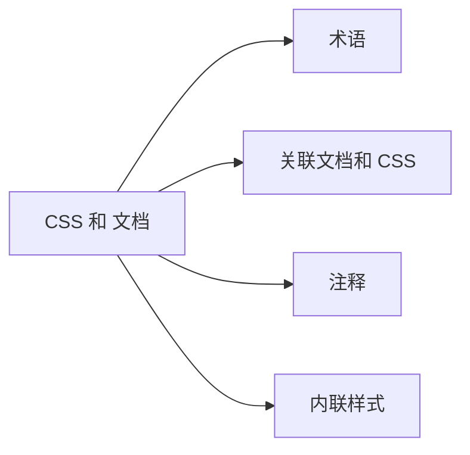

# section 1: CSS 和 文档



## 术语

1. CSS: 层叠样式表(Cascading Style Sheets)。

2. 元素: (element)是文档结构的基础。如 h1, div, p, span, a, img, input 等元素。

    * 在 CSS 中，元素有两种形式: 替换元素和非替换元素；
    * 两种基本元素类型: 块级元素(block-level)和行内元素(inline-level)；

3. 替换元素: (replaced element)用来替换元素内容的部分，并非由文档内容直接表示。如 img, input 等元素。

4. 非替换元素: 其内容由用户代理在元素本身生成的框中显示。大多数 HTML 元素是非替换元素。如 h1, div, p, span, a 等元素。

5. 块级元素: 生成一个元素框，默认填充其父元素的内容区，旁边不能有其它元素。如 h1, div, p 等元素。

6. 行内元素: 在一个文本行内生成元素框，并且不会打断这行文本。如 span, a 等元素。

7. 在 HTML 中，块级元素不能嵌套在行内元素中；在 CSS 中不存在这种限制，可以使用 display 属性任意改变元素的显示角色。

## 关联文档和 CSS

### link 标记

```html
<link rel="stylesheet" type="text/css" href="sheet.css" media="all" />
```

1. 允许 HTML 创作人员将包含 link 标记的文档与其它文档相关联。

2. link 标记必须放在 head 元素中。

3. 属性。

    * rel 代表关系(relation)，值是 stylesheet；
    * type 描述了使用 link 标记加载的数据类型，值是 text/css；
    * href 描述样式表的 URL，可以是绝对 URL，也可以是相对 URL；
    * media 说明这个样式表要应用于表现媒体；

        * all: 所有表现媒体；
        * aural: 语音合成器、屏幕阅读器和文档的其它声音表现；
        * braille: Braille 设备；
        * embossed: Braille 设备打印；
        * handheld: 手持设备，如个人数字助理或者支持 Web 的蜂窝电话；
        * print: 视力正常的用户打印文档时使用；
        * projection: 投影媒体；
        * screen: 屏幕媒体，如桌面计算机监视器；
        * tty: 固定间距环境，如电传打字机；
        * tv: 电视；
        * 多种媒体使用用一个样式表，用逗号分隔 `<link rel="stylesheet" type="text/css" href="sheet.css" media="screen, projection" />`；

4. link 标记可以定义候选样式表(alternate style sheet)，将 rel 属性设置为 alternate stylesheet 就可以定义候选样式表，会根据 title 属性命名候选样式表。

    ```html
    <link rel="stylesheet" type="text/css" href="sheet.css" title="Default" />
    <link rel="alternate stylesheet" type="text/css" href="big-text.css" title="Big Text" />
    <link rel="alternate stylesheet" type="text/css" href="blue-theme.css" title="Blue theme" />
    ```

### style 元素

```html
<style type="text/css" media="all">
div {
  color: red;
}
</style>
```

1. 开始和结束 style 标记之间的样式称为文档样式表(document style sheet)，或者嵌套样式表(embedded style sheet)。

2. 可以使用 @import 指令包含多个外部样式表链接。

### @import 指令

```html
<style type="text/css">
@import url(sheet.css) all;
div {
  color: red;
}
</style>
```

1. @import 指令出现在 style 元素中，并且需要出现在样式表的规则之前，出现在规则之后，浏览器会忽略。

2. 一个文档可以有不只一个 @import 指令，所有的 @import 指令都会被加载并且使用。@import 指令无法指定候选样式表。

3. 如果需要在一个样式表中引入其它外部样式表，只能使用 @import 指令，因为样式表中不能包含任何文档标记，不能使用 link 元素。

### 向后可访问性

1. 古老的浏览器会忽略其无法识别的标记。如果一个浏览器无法识别 style 元素，它就会将 style 元素的标记忽略，style 元素内部的样式声明却能够直接显示在页面上。

2. 为解决以上问题，可以将样式声明包含在一个注释标记中。注释开始标记(`<!--`) 出现在 style 元素开始标记之后，注释结束标记(`-->`)出现在 style 元素结束标记之前。这样如果浏览器无法识别 style 元素标记，浏览器也会注释掉 style 元素内的样式。

```html
<style type="text/css"><!--
@import url(sheet.css) all;
div {
  color: red;
}
--></style>
```

## CSS 注释

1. CSS 注释使用 `/*` 和 `*/` 包含，注释可以跨越多行，但是不能嵌套。

```css
div {
  color: red;   /* red color */
}
```

## 内联样式

```html
<div style="color: red;">这是一个内联样式的文本。</div>
```

1. 使用 HTML 的 style 属性来设置内联样式(inline style)。

2. 除了 body 外部的标记(head, title)，style 属性可以和任何其它标记关联。

3. 一个内联 style 属性只能放置一个声明块，不能放整个样式表，不能使用 @import 标记。
