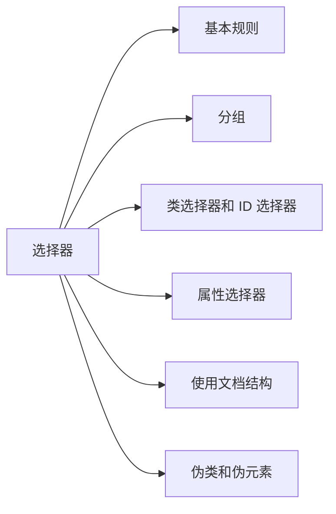

# section 2: 选择器



## 基本规则

### 规则结构

1. 每个样式表由一系列规则组成。

    ```css
    div {
      background-color: yellow;
      color: red;
    }

    span {
      display: block;
      padding: 2px;
    }
    ```

2. 每个规则都有两个基本部分：选择器(selector)和声明块(declaration block)。

    ```css
    div {
      background-color: yellow;
      color: red;
    }
    ```

3. 声明块由一个或者多个声明组成，每个声明是一个属性-值对(property-value)。

    ```css
    background-color: yellow;
    ```

4. 文档的元素就是最基本的选择器。XML 文档中任何元素都可以是选择器，HTML 文档中是某个 HTML 元素，如 div, p, span 等，甚至可以是 html 本身。

    ```css
    html {
      color: red;
    }
    ```

5. 声明中使用了不正确的属性或者不正确的值，这个声明就会被忽略。

    ```css
    html {
      colorr: red; /* no used */
      color: rred; /* no used */
    }
    ```

6. 如果一个属性的值是多个关键字，关键字之间使用空格分隔。

    ```css
    html {
      border: 2px solid red;
    }
    ```

## 分组

### 选择器分组

1. 可以将任意多个选择器分组在一起，使用逗号分隔。如选择所有的 h1 和 div 元素。

    ```css
    h1,
    div {
      color: red;
    }
    ```

2. 通配选择器(universal selector)可以匹配任意元素。如选择所有元素。

    ```css
    * {
      color: red;
    }
    ```

### 声明分组

1. 可以将多个声明分组在一起，各个声明的最后都要使用分号分隔。

    ```css
    div {
      color: red;
      display: inline-block;
    }
    ```

### 结合选择器和声明的分组

1. 可以将多个选择器和声明分组在一起。

    ```css
    div,
    p {
      color: red;
      display: inline-block;
    }
    ```

## 类选择器和 ID 选择器

### 类选择器

1. 将类选择器(class selector)的样式与元素关联，必须将 class 属性指定一个值。如选择类包含 warning 的元素。

    ```css
    .warning {
      color: red;
    }
    ```

    ```html
    <p class="warning">这是一个类选择器警告文本。</p>
    <p>这是一个普通文本。</p>
    ```

2. `.warning` 等价于 `*.warning` 匹配 class 属性包含 warning 的元素。

3. `p.warning` 匹配 class 属性包含 warning 的 p 元素。

### 多类选择器

1. HTML 元素的 class 属性可能包含多个词语，各个词语之间以空格分隔。

    ```html
    <p class="warning help agent">这是一个多类选择器的文本。</p>
    ```

2. `.warning` 匹配 class 属性包含 warning 的元素。

    ```css
    .warning {
      color: red;
    }
    ```

3. `.warning.help` 匹配 class 属性包含 warning 和 help 的元素。

    ```css
    .warning.help {
      color: blue;
    }
    ```

### ID 选择器

1. 将 ID 选择器(id selector)的样式与元素关联，必须将 id 属性指定一个值。如选择 id 属性是 first-para 的元素。

    ```css
    #first-para {
      color: blue;
    }
    ```

    ```html
    <p id="first-para">这是一个 ID 选择器文本。</p>
    <p>这是一个普通文本。</p>
    ```

### 类选择器还是 ID 选择器

1. 文档中可以为多个元素指定相同的类 class，类选择器会匹配多个元素。

2. 文档中相同 ID 的元素最多只能有一个，ID 选择器只能匹配到一个元素。

3. 文档中的 class 属性可以是空格分隔的多个词语组合，使用多类选择器匹配。ID 属性只能是一个词语。

4. 类选择器(点号加类名的记法)对 XML 文档不一定有效，ID 选择器(# 号加 ID 值的记法)可以在任何文档中使用。

## 属性选择器

1. 在某些文档中不能使用类选择器和 ID 选择器，因此引入了属性选择器(attribute selector)，可以根据元素的属性及属性值来选择元素。

2. 简单属性选择器：想选择有某个属性的元素，而不论该属性值是什么。如选择有 class 属性的 div 元素。

    ```css
    div[class] {
      color: red;
    }
    ```

3. 可以根据多个属性选择，只需要将属性选择器连接在一起。如选择同时有 href 和 title 属性的 a 元素。

    ```css
    a[href][title] {
      color: red;
    }
    ```

4. 也可以根据属性-属性值选择，属性值严格相等。如选择 title 属性值是 help text 的 div 元素。

    ```css
    div[title="help text"] {
      color: red;
    }
    ```

    * 类选择器是 class 属性值包含词语，属性选择器是 class 属性值必须严格等于词语；
    * `div.warning` 可以匹配 `<div class="warning blue">warning blue</div>` 和 `<div class="warning">warning</div>`；
    * `div[class="warning blue"]` 可以匹配 `<div class="warning blue">warning blue</div>`，不能匹配`<div class="warning">warning</div>`，也不能匹配 `<div class="warning  blue">warning 空格 blue</div>`；
    * `div[warning="warning"]` 可以匹配 `<div class="warning">warning</div>`，不能匹配`<div class="warning blue">warning blue</div>`；

        ```css
        div.warning {
          color: red;
        }
        div[class="warning"] {
          color: green;
        }
        div[class="warning blue"] {
          color: blue;
        }
        ```

5. 可以将多个属性-属性值连接在一起。如选择 title 属性值是 help text，同时 name 属性值是 good name 的 div 元素。

    ```css
    div[title="help text"][name="good name"] {
      color: red;
    }
    ```

6. 可以根据部分属性值选择，根据属性值中出现用空格分隔的词语来选择。如选择 title 属性值包含 help 词语的 div 元素。

    ```css
    div[title~="help"] {
      color: red;
    }
    ```

    * 类选择器等价于 class 部分属性值选择器；

        ```css
        div.warning {
          color: red;
        }
        div[class~="warning"] {
          color: red;
        }
        ```

7. 字串匹配属性选择器。

| 类型 | 规则 |
| -- | :-- |
| [title^="help"] | 匹配 title 属性值以 help 开头的元素 |
| [title$="help"] | 匹配 title 属性值以 help 结尾的元素 |
| [title*="help"] | 匹配 title 属性值包含 help 字符串的元素 |

### 特定属性选择类型

1. 选择以特定值开头的属性值，属性值就是特定值或者属性值通过连字符分隔。常用于匹配语言值。

    ```css
    div[lang|="en"] {
      color: red;
    }
    ```

2. 选择 lang 属性值以 en 词语开头的 div 元素。

    ```css
    div[lang |= "en"] {
      color: red;
    }
    ```

    * 可以匹配 `<div lang="en">en</div>`
    * 可以匹配 `<div lang="en-us">en-us</div>`
    * 可以匹配 `<div lang="en-us cn">en-us cn</div>`
    * 不可以匹配 `<div lang="en ">en空格</div>`
    * 不可以匹配 `<div lang="en us">en空格us</div>`
    * 不可以匹配 `<div lang="en_us">en_us</div>`
    * 不可以匹配 `<div lang="enus">enus</div>`

3. 选择 lang 属性值以 en cn 词语开头的 div 元素。

    ```css
    div[lang |= "en cn"] {
      color: red;
    }
    ```

    * 可以匹配 `<div lang="en cn">en</div>`
    * 可以匹配 `<div lang="en cn-us">en-us</div>`
    * 可以匹配 `<div lang="en cn-us cn">en cn-us cn</div>`
    * 不可以匹配 `<div lang="en cn ">en空格cn空格</div>`
    * 不可以匹配 `<div lang="en cn us">en空格cn空格us</div>`
    * 不可以匹配 `<div lang="en cn_us">en cn_us</div>`
    * 不可以匹配 `<div lang="en cnus">en cnus</div>`

## 使用文档结构

1. 文档结构。

    ```html
    <!DOCTYPE html>
    <html lang="en">
    <head>
      <title>Document</title>
    </head>
    <body>
      <h1>标题文本</h1>
      <p><strong>HTML</strong> 是英文 Hyper Text Mark-up Language(<em>超文本标记语言</em>)的缩写。</p>
      <div>
        <ul>
          <li>文本</li>
          <li>链接</li>
          <li>图片</li>
        </ul>
      </div>
    </body>
    </html>
    ```

2. 文档树。

    ```mermaid
    graph TB;
    html-->head-->title
    html-->body-->h1
    body-->p-->em
    p-->strong
    body-->div-->ul-->Ali[li]
    ul-->Bli[li]
    ul-->Cli[li]
    ```

3. 在文档树中，如果一个元素在另外一个元素的直接上层，他们是父子关系。如 p 元素是 em 和 strong 元素的父元素。如果一个元素到另外一个元素的路径上要经过两层或者多层，他们是祖先-后代关系。如  div 元素是 li 元素的祖先元素。父子关系是祖先-后代关系的特例。

4. body 元素是浏览器默认显示的所有元素的祖先，html 元素是整个文档的祖先，也称为根元素。

### 后代选择器

1. 后代选择器(descendant selector)，也称为包含选择器，或者上下文选择器(contextual selector)。如选择祖先元素包含 body 元素的所有 em 元素。

    ```css
    body em {
      color: red;
    }
    ```

2. 后代选择器不仅限于两个选择器。如选择祖先元素包含 ul 元素，并且该 ul 的祖先元素包含 body 元素的所有 li 元素。

    ```css
    body ul li {
      color: red;
    }
    ```

### 子元素选择器

1. 子元素选择器只匹配直接相连的父子元素。如选择父元素是 p 元素的所有 em 元素。

    ```css
    p > em {
      color: red;
    }
    ```

2. 结合后代选择器和子元素选择器。如选择父元素是 p 元素，并且该 p 元素的祖先元素包含 body 元素的所有 em 元素。

    ```css
    body p > em {
      color: red;
    }
    ```

### 相邻兄弟元素选择器

1. 可以使用相邻兄弟结合符选择兄弟元素。如选择紧接着 h1 元素之后的 p 元素。

    ```css
    h1 + p {
      color: red;
    }
    ```

2. 两个元素之间的文本内容不会影响相邻兄弟结合符的作用。如选择紧接着 strong 元素之后的 em 元素。

    ```css
    strong + em {
      color: red;
    }
    ```

    * 可以匹配 `<p>这是一个<strong>粗体</strong><em>斜体</em>文本</p>`；
    * 也可以匹配 `<p>这是一个<strong>粗体</strong>文本内容是<em>斜体</em>文本</p>`；

## 伪类和伪元素

### 伪类选择器

1. 有两种基本的锚类型：已访问的和未访问的。这些类型称为伪类(pseudo-class)。使用这些伪类的选择器称为伪类选择器(pseudo-class selector)。

2. 所有伪类的前面都有一个冒号。

    * 如选择已访问过的 a 元素；

        ```css
        a:visited {
          color: red;
        }
        ```

    * 如选择未访问过的 a 元素，不能选择没有 href 属性的 a 元素；

        ```css
        a:link {
          color: red;
        }
        ```

3. 静态伪类：第一次显示之后，不会再改变文档的样式，如 :link, :visited。

4. 动态伪类：根据用户行为改变文档的外观。

    | 伪类名 | 描述 |
    | :-- | :-- |
    | :focus | 拥有输入焦点的元素 |
    | :hover | 鼠标停留的元素 |
    | :active | 被用户输入激活的元素 |

5. 锚样式集合。前两个静态伪类，先有链接再有访问，后三个动态伪类，先获得焦点再有鼠标停留最后鼠标点击。

    ```css
    :link {}
    :visited {}
    :focus {}
    :hover {}
    :active {}
    ```

6. 动态伪类可以应用到任何元素。

    ```css
    input:focus {}
    body:hover {}
    ```

7. 使用静态伪类(:first-child)选择元素的第一个子元素。如选择所有符合条件的 p 元素，该 p 元素是任意元素的第一个子元素。

    ```css
    p:first-child {
      color: red;
    }
    ```

    * 可以匹配 `<div><p>这是可以匹配的文本</p></div>`；
    * 不可以匹配 `<div><span>这是第一个子元素</span><p>这是不可以匹配的文本</p></div>`；

8. 伪类的实质是把某种幻想类关联到与伪类相关的元素。

9. 根据元素的语言选择使用 :lang() 伪类，:lang() 伪类像是一个 |= 属性选择器。如选择法语元素。

    ```css
    :lang(fr) {
      color: red;
    }
    ```

    * 伪类选择器和属性选择器之间的主要差别在于语言信息可以从很多地方获得，其中可能是在元素外，如元素的 lang 属性，META 元素以及 HTTP 首部。伪类选择器比属性选择器健壮。

10. 可以在同一个选择器中结合使用伪类。如选择鼠标停留在未访问的链接和停留在已访问链接。

    ```css
    :link:hover {
      color: red;
    }
    :visited:hover {
      color: blue;
    }
    ```

    * 避免把互斥的伪类结合在一起。如一个链接不能既是未访问的，又是已访问的。

### 伪元素选择器

1. 伪元素能够在文档中插入幻想的元素，从而得到某种效果，所有伪元素的前面都有两个冒号。

2. 首字母样式。设置一个块级元素的第一个字母的样式，而且仅对该首字母设置样式。如选择 p 元素的首字母。

    ```css
    p::first-letter {
      color: red;
    }
    ```

3. 首行样式。设置一个块级元素的第一行文本的样式。如选择 p 元素的首行。

    ```css
    p::first-line {
      color: red;
    }
    ```

4. 所有伪元素都必须放在出现该伪元素的选择器的最后，选择的主体是出现该伪元素的元素。

    ```css
    ❌
    p::first-line span {
      color: red;
    }
    ```

5. 元素之前或者元素之后插入内容的样式。设置一个块级元素之前或者之后的内容和样式，一般会设置 content 属性。如在 p 元素之前加入 red 的 before 文本，在 p 元素之后加入 blue 的 after 文本。

    ```css
    p::before {
      content: "before";
      color: red;
    }
    p::after {
      content: "after";
      color: blue;
    }
    ```

## 选择器列表

| 选择器 | 示例 | 说明 | CSS 版本 |
| :-- | :-- | :-- | -- |
| .class | .warning-alert | 选择 class 属性包含词语 warning-alert 的所有元素 | 1 |
| #id | #page-intro | 选择 id 属性等于 page-intro 的元素 | 1 |
| element | p | 选择所有的 p 元素 | 1 |
| element, element | div, p | 选择所有的 div 元素和 p 元素 | 1 |
| element element | div p | 选择祖先元素包含 div 元素的所有 p 元素 | 1 |
| :link | :link | 选择所有未访问的链接 | 1 |
| :visited | :visited | 选择所有已访问的链接 | 1 |
| :hover | :hover | 选择所有鼠标停留在上面的链接 | 1 |
| :active | :active | 选择所有活动的链接 | 1 |
| ::first-letter | p::first-letter | 选择所有 p 元素的首字母 | 1 |
| ::first-line | p::first-line | 选择所有 p 元素的首行 | 1 |
| \* | \* | 选择所有的元素 | 2 |
| element > element | div > p | 选择父元素是 div 元素的所有 p 元素 | 2 |
| element + element | div + p | 选择紧接着 div 元素之后的 p 元素 | 2 |
| [attribute] | [lang] | 选择具有 lang 属性的所有元素 | 2 |
| [attribute = "value"] | [lang = "en"] | 选择 lang 属性等于 en 的所有元素 | 2 |
| [attribute ~= "value"] | [lang ~= "en"] | 选择 lang 属性包含词语 en 的所有元素 | 2 |
| [attribute \|= "value"] | [lang \|= "en"] | 选择 lang 属性以词语 en 开头的所有元素 | 2 |
| :focus | input:focus | 选择获得焦点的 input 元素 | 2 |
| :first-child | p:first-child | 选择是其父元素的第一个子元素的所有 p 元素 | 2 |
| :lang(language) | p:lang(fr) | 选择 lang 属性以词语 fr 开头的所有 p 元素 | 2 |
| ::before | p::before | 在所有的 p 元素之前插入内容 | 2 |
| ::after | p::after | 在所有的 p 元素之后插入内容 | 2 |
