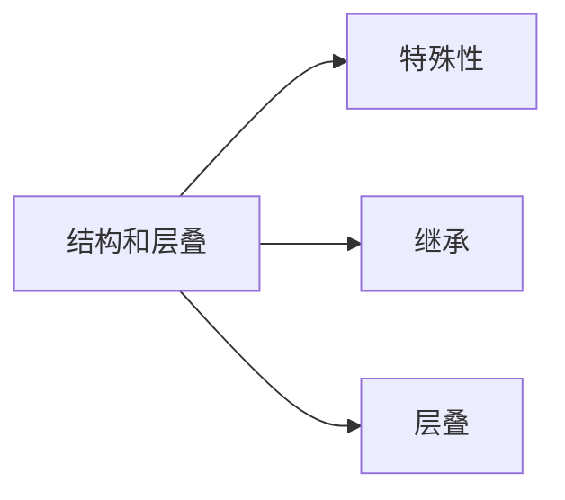

# section 3: 结构和层叠



1. CSS 继承(Inheritance): 从一个元素向其后代元素传递属性值所采用的机制。

2. 确定应当向一个元素应用哪些值时，用户代理不仅要考虑继承，还要考虑声明的特殊性，另外需要考虑声明本身的来源。这个过程就是层叠(cascade)。

## 特殊性

1. 可以使用多种不同的规则来选择元素，每个规则都有自己的选择器。规则的特殊性决定了使用哪个规则。

2. 对于每个规则，用户代理会计算选择器的特殊性，并将这个特殊性附加到规则的各个声明中，如果一个元素有多个冲突的属性声明，那么有最高特殊性的声明就会胜出。

3. 选择器的特殊性由选择器本身的组件确定。特殊性值表述为 4 个部分，如 0, 0, 0, 0

    * 对于选择器中给定的各个 ID 属性值，加 0, 1, 0, 0；
    * 对于选择器中给定的各个类属性值，属性选择或者伪类，加 0, 0, 1, 0；
    * 对于选择器中给定的各个元素和伪元素，加 0, 0, 0, 1；
    * 结合符和通配选择器对特殊性没有贡献，加 0, 0, 0, 0；

        ```css
        div {}                                      /* 0, 0, 0, 1 */
        ::first-letter                              /* 0, 0, 0, 1 */
        .warning {}                                 /* 0, 0, 1, 0 */
        [href] {}                                   /* 0, 0, 1, 0 */
        :link {}                                    /* 0, 0, 1, 0 */
        #name {}                                    /* 0, 1, 0, 0 */
        div p {}                                    /* 0, 0, 0, 2 */
        div.warning > p {}                          /* 0, 0, 1, 2 */
        div, p {}                                   /* 0, 0, 0, 1 */
        div * {}                                    /* 0, 0, 0, 1 */
        html > body div#name p.warning a:link {}    /* 0, 1, 2, 5 */
        ```

### 声明和特殊性

1. 规则的特殊性会附加到规则的各个声明中。如以下规则会被拆分成两个声明规则。

    ```css
    div {
      color: red;
      width: 100px;
    }
    ```

    * `div { color: red; }      /* 0, 0, 0, 1 */`
    * `div { width: 100px }     /* 0, 0, 0, 1 */`

2. 用户代理会确定哪些规则与一个元素匹配，计算出所有相关声明及其特殊性，确定哪些规则优先，将优先的规则应用到元素。如以下两个声明，会应用 `color: red;`。

    ```css
    div {
      color: blue;    /* 0, 0, 0, 1 */
    }
    div.warning {
      color: red;     /* 0, 0, 1, 1 */
    }
    ```

### 通配选择器的特殊性

1. 通配符和结合符对选择器的总特殊性没有任何影响。

    ```css
    body div {}     /* 0, 0, 0, 2 */
    body * div {}   /* 0, 0, 0, 2 */
    ```

### ID 和属性选择器的特殊性

1. ID 选择器和指定 id 属性的属性选择器的特殊性不相同。

    ```css
    #name {}          /* 0, 1, 0, 0 */
    [id="name"] {}    /* 0, 0, 1, 0 */
    ```

### 内联样式的特殊性

1. 内联样式声明比其它声明的特殊性都高，代表特殊性的第一个数值。如以下两个声明，会应用 `color: blue;`。

    ```css
    #name {
      color: green;
    }
    ```

    ```html
    <p #id="name" style="color: green;">这里有一个内联样式。</p>
    ```

2. CSS 特殊性变迁。

    * CSS 2 时的特殊性包含 3 个数值(0, 0, 0)，内联样式声明的特殊性是 `1, 0, 0`，ID 选择器声明的特殊性也是 `1, 0, 0`，ID 选择器的样式会覆盖内联样式；
    * CSS 2.1 以后特殊性包含 4 个数值(0, 0, 0, 0)，内联样式声明的特殊性是 `1, 0, 0, 0`，ID 选择器声明的特殊性是 `0, 1, 0, 0`，内联样式会覆盖 ID 选择器的样式；

### 重要性

1. CSS 2.1 提出重要声明，在声明的结束分号之前插入 !import 来标志。

    ```css
    .warning {
      color: red !import;
    }
    ```

2. !import 标志必须放在声明的最后，分号之前。如果 !import 放在其它位置，整个声明都将无效。

3. 所有的重要声明会分组在一起，重要声明的冲突性冲突会在重要声明内部解决，而不会与非重要声明相混。

4. 所有非重要声明也归为一组，使用特殊性来解决冲突。

5. 如果一个重要声明和一个非重要声明冲突，应用重要声明的样式。

## 继承

1. 基于继承机制，样式不仅应用到指定的元素，还会应用到它的后代元素。

2. 元素不会把值向上传递到其祖先元素，但是 body 元素的背景样式可以传递到 html 元素。

3. 大多数盒模型属性(外边距，内边距，背景，边框)都不能被继承。

4. 继承的值没有特殊性，甚至连 0 特殊性(如通配符 0, 0, 0, 0)都没有。

## 层叠

### 层叠规则

1. 找出所有相关的规则，这些规则都包含与一个给定元素匹配的选择器。
2. 按显式权重对应用到该元素的所有声明排序。

    * 标志 !import 的规则的权重要高于没有 !import 标志的规则；

    * 按来源对应用到给定元素的所有声明排序。共有 3 种来源：创作人员，用户，用户代理。一般情况下，创作人员的样式要优先于用户的样式，有 !import 标志的用户样式要强于其它所有样式，包括有 !import 标志的创作人员样式，创作人员样式和用户样式都要优先于用户代理的默认样式；

3. 按照特殊性对应用到给定元素的所有声明排序，较高特殊性的声明权重要大于较低特殊性的声明。

4. 按照出现顺序对应用到给定元素的所有声明排序，一个声明在样式表或者文档中越靠后出现，它的权重就越大。如果样式表中有导入的样式表，一般情况下，出现在导入样式表的声明在前，主样式表中的所有声明靠后。

### 按照权重和来源排序

1. 如果两个样式声明应用到同一个元素，其中一个声明有 !import 标志，这个声明就胜出。如以下 2 个声明，样式表声明会胜出。

    ```html
    <p style="color: black;">这段文字是<em>红色</em>的。</p>
    ```

    * `p { color: red !import; }`；

2. 如果创作人员样式声明和用户样式声明应用到同一个元素，创作人员样式声明胜出。如以下 2 个声明，第一个胜出。

    ```html
    <p>这段文字是<em>红色</em>的。</p>
    ```

    * `p { color: red; } /* develop style */`；
    * `p { color: black; } /* reader style */`；

3. 如果创作人员样式声明包含 !import 标志，用户样式声明也包含 !import 标志，用户样式声明胜出。如以下 2 个声明，第二个胜出。

    ```html
    <p>这段文字是<em>黑色</em>的。</p>
    ```

    * `p { color: red !import; } /* develop style */`；
    * `p { color: black !import; } /* reader style */`；

4. 声明权重由大到小的顺序依次是

    * 用户的 !import 声明；
    * 创作人员的 !import 声明；
    * 创作人员的普通声明；
    * 用户的普通声明；
    * 非 CSS 表现提示，如 font 元素；
    * 用户代理的默认声明；

### 按照特殊性排序

1. 多个声明应用到同一个元素，如果他们的权重和来源相同，则按照特殊性排序，最特殊的声明胜出。如以下 2 个声明，第一个胜出。

    ```html
    <p id="name" class="user">这段文字是<em>红色</em>的。</p>
    ```

    ```css
    p#name {
      color: red;
    }

    p.user {
      color: black;
    }
    ```

### 按照顺序排序

1. 多个声明应用到同一个元素，如果他们的权重，来源和特殊性都相同，则在样式表中最后出现的声明胜出。如以下 2 个声明，第二个会胜出。

    ```html
    <p class="user warning">这段文字是<em>黑色</em>的。</p>
    ```

    ```css
    p.user {
      color: red;
    }

    p.warning {
      color: black;
    }
    ```

2. 文档中包含的规则(style 内联属性和 style 元素样式)比导入的规则权重高。如以下 2 个声明，第一个会胜出。

    ```html
    <style>
    /* 这是 style 元素的样式 */
    p.user {
      color: red;
    }
    </style>
    <p class="user warning">这段文字是<em>红色</em>的。</p>
    ```

    ```css
    /* 这是导入的外部样式 */
    .warning {
      color: black;
    }
    ```

3. 正是因为这种按顺序排序，才有了链接样式的顺序，link-visited-hover-active(LVHA)。

    ```css
    :link {}
    :visited {}
    :hover {}
    :active {}
    ```

4. 多个声明设置同一个元素的同一个属性才会出现冲突，如果声明设置的是不同的样式，那么顺序就无关紧要了。

### 非 CSS 表现提示

1. 文档有可能包含非 CSS 的表现提示，如 font 元素。非 CSS 提示会被处理为特殊性 0，并出现在创作人员样式表的最前面。

2. 只要有创作人员样式或者用户样式，这种表现就会被覆盖。
