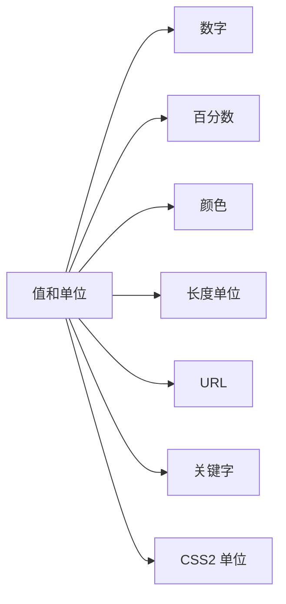

# section 4: 值和单位



## 数字

1. CSS 中有两类数字：整数和实数。这些数字类型主要作为其它值类型的1基础，也可以用作属性的值。

## 百分数

1. 百分数值是一个计算得出的实数，其后跟有一个百分号(%)。

2. 百分数值总是相对于另一个值，这个值可能是同一个元素另一个属性值，也可能是从父元素继承来的一个值，也可能是祖先元素的一个值。

## 颜色

### 命名颜色

1. 按名使用颜色，如 red。

2. CSS 2.1 中规范了 17 个颜色名。

    `aqua, black, blue, fuchsia, gray, green, lime, maroon, navy, olive, orange, purple, red, silver, teal, white, yellow`

3. 大多数浏览器能识别多达 140 个颜色名，这些颜色名基于标准 X11 RGB 值。

### 用 RGB 指定颜色

1. 计算机通过组合不同的红色，绿色和蓝色分量来创造颜色，这种组合称为 RGB 颜色。

### 函数式 RGB 颜色

1. 函数式 RGB 记法一般语法是 `rgb(color)`，其中 color 用一个百分数或者整数三元组表示，百分数值范围在 0%～100%，整数范围在 0～255。

2. 百分数记法指定白色和黑色。

    * 白色 rgb(%100, 100%, 100%)；
    * 黑色 rgb(0%, 0%, 0%)；

3. 整数三元组记法指定白色和黑色。

    * 白色 rgb(255, 255, 255)；
    * 黑色 rgb(0, 0, 0)；

4. 百分数记法可以使用小数。如某个颜色 rgb(25.5%, 40%, 98.2%)，用户代理可能会忽略小数点，取最近的整数，从而得到 rgb(26%, 40%, 98%)。

5. 整数三元组中只能使用整数。

6. 不管是在百分数记法还是整数三元组记法，如果值落在范围之外，都会被剪裁到最接近的范围边界。

    * rgb(-40%, 300%, 10%) --> rgb(0%, 100%, 10%)；
    * rgb(-40, 300, 10) --> rgb(0, 255, 10)；

7. 百分数记法和整数三元组记法转换，将百分数记法中各 RGB 分量的百分数，分别乘 255 ，再将这些值取最接近的整数即可得到整数三元组记法。

    * rgb(16%, 20%, 37%)  --> rgb(40.8, 51, 94.35) --> rgb(41, 51, 94)；

### 十六进制 RGB 颜色

1. 将三个介于 00～FF 的十六进制数连接起来，就可以设置一个颜色，一般记法为 #RRGGBB。

    * 白色 #FFFFFF；
    * 黑色 #000000；

2. 如果组成十六进制的 3 组数各自都是成对的，还可以使用简写记法 #RGB。

    * 白色 #FFF；
    * 黑色 #000；

### 颜色汇总

1. 浏览器可能无法识别颜色名字，优先使用 RGB 或者十六进制三元组。

### WEB 安全颜色

1. WEB 安全颜色是指在 256 色计算机系统上总能避免抖动的颜色。

2. WEB 安全颜色可以表示为 RGB 值的 20% 和 51(相应的十六进制值 33)的倍数。0% 或者 0 也是一个安全值。

3. WEB 安全颜色使用 RGB 百分数记法，各个分量值要么都是 0%，要么是个能被 20 整除的数。

    * rgb(0%, 0%, 0%)；
    * rgb(20%, 40%, 60%);
    * rgb(100%, 60%, 0%);

4. WEB 安全颜色使用 RGB 整数三元组记法，各个分量值要么是 0，要么是能被 51 整除的数。

    * rgb(0, 0, 0)；
    * rgb(51, 102, 153);
    * rgb(255, 153, 0)；

5. WEB 安全颜色使用十六进制记法，各个分量值只能使用 00，33，66，99，CC，FF。

    * #000；
    * #369；
    * #F90；

## 长度单位

1. 所有的长度单位都可以表示为正数或者负数，其后跟一个标签，部分属性只能接受正数。

2. 所有长度单位后面都有一个两个字母的缩写，表示具体的长度单位，如 pt。

3. 当长度为 0 时，后面不需要跟单位。

### 绝对长度单位

1. 英寸(in)。

2. 厘米(cm)。

    * 1 cm = 0.394 in
    * 1 in = 2.54 cm

3. 毫米(mm)。

    * 1 mm = 0.1 cm
    * 1 cm = 10 mm
    * 1 mm = 0.0394 in
    * 1 in = 25.4 mm

4. 点(pt)：是一个标准印刷度量单位，在打印机和打字机上使用数十年。

    * 1 in = 72 pt

5. 派卡(pc)：也是一个印刷度量单位。

    * 1 pc = 12 pt
    * 1 in = 6 pc

6. 在一个 WEB 浏览器上，显示会受显示器的尺寸影响，显示器的分辨率也有影响。

7. 处理绝对长度，每英寸的实际像素数(ppi)。

    * windows 系统 ppi 都高于 72，甚至达到 120；
    * mac 系统内置 ppi 默认是 72；

8. 绝对单位在定义打印文档的样式表时更有用，通常使用英寸，点和派卡来度量。

9. 绝对单位在 WEB 浏览器中不是最佳的做法。

### 相对长度单位

1. 相对长度单位是根据与其它事物的关系来度量的，如屏幕分辨率，可视区的宽度，用户的首选项设置等。

2. em(em-height)，ex(x-height)是常用的印刷度量单位。px代表像素，是计算机显示器上的一个点，它取决于显示设备的分辨率，所以是相对单位。

3. 在 CSS 中，1 个 em 定义为某个元素给定字体的 font-size 值。如果一个元素的 font-size 是 14 像素，那么这个元素的 1 em 就是 14 像素。

4. 在设置字体的大小时，em 的值会相对于父元素的字体大小改变。

5. ex 是指所用字体中小写 x 的高度。如果一个元素有两段文本，尽管元素中文本字体大小是一样，但是各段使用不同的字体，那么各段的 ex 值可能不一样。

6. 实际中，大多数字体没有指定 ex 的高度值，而且字体的小写字母是大写字母高度的一半，所以假设 1 ex 就是 0.5 em。

7. 部分浏览器会在内部显示一个小写的 x，并且计算相应的像素值来确定其高度与此字符 font-size 值之比，从而确定给定字体小写 x 的高度。

8. 非常适合使用像素来度量图像大小，因为图像的宽度和高度本身就是像素数。

9. 像素是一种相对长度单位，显示器上的小色框是一个像素，但是多少个像素等于一英寸，这对于不同设备是不固定的。

    * CSS2.1 建议将 96ppi 作为参考像素，如果显示设备与参考像素不一致，就必须将像素长度重新缩放为更合理的度量；
    * 如果设置字体大小 font-size 等于 18px，在 96ppi 的浏览器上显示，字体大小事 18/96 等于 0.1875 英寸，在 120ppi 的打印机上显示字体大小变成了 18/120 等于 0.15 英寸；

10. 最好的度量是相对度量，特别是 em，如果合适也可以使用 px。em 是最灵活的，对于元素的其它方面，如边框或者定位，就更适合使用 px。

## URL

1. 使用 URL 的格式。

    * url(protocol://server/pathname)：绝对 URL(absolute URL)。不论这个 URL 放在哪里，它都能正常工作，定义了 WEB 空间一个绝对位置；
    * url(pathname)：相对 URL(relative URL)。它指定的是一个相对于该 URL 躲在文档的位置；

2. 在 CSS 中，相对 URl 要相对于样式表本身，而不是相对于使用该样式表的 HTML 文档。

3. url 和开始括号之间不能有空格。

## 关键字

1. 有时候一个值需要使用某个词来描述，这个词就称为关键字。

    * none：`a { text-decoration: none; }`；
    * underline：`a { text-docoration: underline; }`；

2. inherit：这个关键字是所有属性共有的，设置一个元素的属性值与其父元素相同。

    ```html
    <style>
      #tool {
        background: blue;
        color: white;
      }
    </style>
    <div id="tool">
      <a href="link.html">链接颜色</a>
    </div>
    ```

    * 上面 html 中，div 元素指定背景是蓝色，字体是白色；a 元素用户代理默认指定字体颜色是蓝色；要想将 a 元素的字体颜色继承 div 元素的白色字体，需要指定；

        ```css
        #tool a {
          color: inherit;
        }
        ```

## CSS2 单位

1. 这些单位都与声音样式表有关。

2. 角度值。用于定义给定的声音从哪个位置发出。共有 3 中角度：度(deg)，梯度(grad)弧度(rad)。

    * 直角可以声明为 90deg，100grad 或者 1.57rad；
    * 不论值为多少，都会解释为 0～360 度范围的值；
    * 负数值也会被转换，如 -90deg 等同于 270deg；

3. 时间值。用于指定语音元素之间的延迟。可以表示为毫秒(ms)，也可以表示为秒(s)。时间值不允许负值。

4. 频率值。用于为语音浏览器可以产生的声音声明一个给定的频率。频率值可以表示为赫兹(Hz)，也可以表示为兆赫(MHz)。频率值不允许负值。

5. 目前支持所有这些值的唯一一个用户代理是 Emacspeak。
