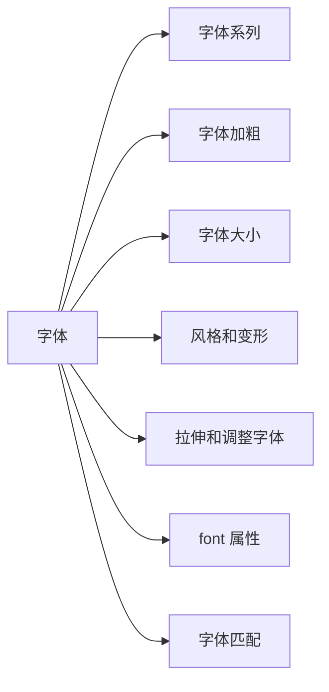

# section 5: 字体



1. CSS 字体处理中最复杂的部分是字体系列(font-family)匹配和字体加粗(font-weight)匹配，其次是字体大小(font-size)计算。

2. CSS 中与字体相关的方面还包括字体风格(如斜体)和字体变形(如小型大写字母)。

3. 字体样式的所有方面都集中在一个属性 font。

## 字体系列

1. 字体 Times 是多种变形的组合，是一个字体系列(font family)，包括 TimesRegular，TimesBold，TimesItalic 等，Times 的每一种变形都是一个具体的字体风格(font face)。

2. 如果字体中的所有字符根据其大小有不同的宽度，则称该字体是成比例的。上下短线是每个字符笔划末端的装饰。

3. CSS 定义了 5 种通用字体。

    * Serif 字体，这些字体成比例，而且有上下短线。如 Times，Georgia 等；
    * Sans-serif 字体，这些字体是成比例的，而且没有上下短线。如 Helvetica，Geneva 等；
    * Monospace 字体，这些字体不是成比例的，通常用于模拟打字机打出的文本，老式点阵打印机的输出，甚至更老式的视频显示终端。采用这些字体，每个字符的宽度都完全相同。这些字体可能有上下短线，也可能没有。如 Courier 等；
    * Cursive 字体，这些字体试图模仿人的手写体，主要有曲线和 serif 字体中没有的笔划装饰组成。如 Zapf Chancery 等；
    * Fantasy 字体，这些字体无法用任何特征来定义，就是无法划分到其它字体中。如 Western 等；

4. 理论上，用户安装的任何字体系列都会落入到上述某种通用字体系列中。

### 使用通用字体系列

1. 可以使用 `font-family` 在文档中采用任何字体系列。

    | 属性 | font-family |
    | -- | :-- |
    | 值 | generic-family, family-name,<br>inherit |
    | 初始值 | 用户代理指定 |
    | 应用于 | 所有元素 |
    | 继承性 | 有 |
    | 计算值 | 根据指定确定 |

    * generic-family 是字体样式名称；
    * family-name 是字体系列名称；

    ```css
    div {
      font-family: 'Zurich Bold', sans-serif;
    }
    p {
      font-family: 'Zurich Light', sans-serif;
    }
    ```

2. 希望文档使用一种 sans-serif 通用字体系列，但是不关心使用哪一种具体字体。

    ```css
    body {
      font-family: sans-serif;
    }
    ```

    * 用户代理就会从 sans-serif 字体系列中选择一个字体(如 Helvetica)，并将其应用到 body 元素。因为有继承，这种字体还将应用到 body 元素的所有后代元素；

3. 希望文档使用一种 Georgia 字体。

    ```css
    body {
      font-family: Georgia;
    }
    ```

    * 如果用户代理上没有 Georgia 字体，它会忽略这个声明，使用默认字体显示文档；
    * 可以结合特定字体名和通用字体系列来显示文档。如以下声明表示文档使用 Georgia 字体，如果 Georgia 字体不可用，使用另外一种 serif 通用字体；

        ```css
        body {
          font-family: Georgia, serif;
        }
        ```

4. 建议所有的 font-family 声明中都提供一个通用字体系列。

    * `p { font-family: Arial, sans-serif; }`；
    * `p { font-family: TimesNR, serif; }`；
    * `p { font-family: Times, TimesNR, 'New Century Schoolbook', Georgia, 'New York', serif; }`；

5. 如果一个字体名中包含一个或者多个空格，或者字体名包含 # 或 $ 之类的符号，需要在 font-family 声明中加引号。

    ```css
    p {
      font-family: Wedgie, 'Karrank%', 'New York';
    }
    ```

6. 如果将一个通用字体名加引号(如 'serif')，用户代理认为你需要一个与此同名的特定字体(如特定字体 'serif')，而不是一个通用字体系列(如 serif)。

7. 样式表中可以使用单引号，也可以使用双引号，但是如果在元素的 style 属性中使用 font-family 声明，必须要使用单引号。

    ```html
    <p style="font-family: Wedgie, 'Karrank%', 'New York';">这是一段文字。</p>
    ```

## 字体加粗

1. 使用 `font-weight` 属性，CSS 允许对字体加粗有更多的控制。

    | 属性 | font-weight |
    | -- | :-- |
    | 值 | normal, bold, bolder, lighter,<br>100, 200, 300, 400, 500, 600, 700, 800, 900,<br>inherit |
    | 初始值 | normal |
    | 应用于 | 所有元素 |
    | 继承性 | 有 |
    | 计算值 | 数字值(如 100)，或者数字值加上相对数(bolder 或 lighter) |

    ```css
    div {
      font-weight: bold;
    }
    p {
      font-weight: 600;
    }
    ```

### 加粗规则

1. 关键字 100～900 为字体指定了 9 级加粗度，如果一个字体内置了 9 个加粗级别，这些数字就映射到内置的加粗级别， 100 对应最细的字体变形，900 对应最粗的字体变形。

2. 这些数字本身并没有固定的加粗程度，只是规定，每个数字对应的加粗程度至少与前一个数字加粗程度相同。

3. 关键字 normal 等价于 400，bold 等价于 700。

4. 如果字体内置的加粗级别少于 9 种，用户代理需要额外做转换。

    * 如果未指定 500 的加粗度，其加粗程度与 400 相同；
    * 如果未指定 300 的加粗度，则为之指定下一个比 400 更细的变形，如果没有更细的变形，其加粗程度与 400 相同。这种方法同样适用于 200 和 100；
    * 如果未指定 600 的加粗度，则为之指定下一个比 400 更粗的变形，如果没有更粗的变形，其加粗程度与 500 相同。这种方法同样适用于 700， 800 和 900；

### 字体更粗

1. 将一个元素的加粗设置为 bolder。

    * 用户代理首先知道从父元素继承的 font-weight 值，确定字体变形(如父元素 font-weight 是 100，是 light 变形)；
    * 然后选择字体加粗的一个字体变形(如比 light 变形加粗的字体变形是 regular，font-weight 是 400)，在满足这个字体变形的数中选择最小的一个数(如 400)；
    * 如果没有可用的字体，用户代理会把该元素的字体加粗设置为下一个更大的数，直到这个加粗值是 900；
    * 数值变粗 (light)100 --> (regular)400 --> (bold)700 --> (bold)800 --> (bold)900；

### 字体更细

1. 将一个元素的加粗设置为 lighter。

    * 用户代理首先知道从父元素继承的 font-weight 值，确定字体变形(如父元素 font-weight 是 900，是 bold 变形)；
    * 然后选择字体加细的字一个字体变形(如比 bold 变形加细的字体变形是 regular，font-weight 是 400)，在满足这个变形的数中选择最大的一个数(如 600)；
    * 如果没有可用的字体，用户会把该元素的字体加细设置为下一个更小的数，直到这个加细值是 100；
    * 数值变细 (bold) 900 --> (regular)600 --> (light)300 --> (light)200 --> (light)100；

## 字体大小

1. 使用 `font-size` 属性确定字体大小。

    | 属性 | font-size |
    | -- | :-- |
    | 值 | xx-small, x-small, small, medium, large, x-large, xx-large, smaller, larger,<br>length, percentage,<br>inherit |
    | 初始值 | medium |
    | 应用于 | 所有元素 |
    | 继承性 | 有 |
    | 百分数 | 根据父元素的字体大小来计算 |
    | 计算值 | 绝对长度 |

    * length 是数值加长度单位，如 12px，36pt 等；
    * percentage 是百分数，如 50%；

    ```css
    div {
      font-size: larger;
    }
    p {
      font-size: 14px;
    }
    span {
      font-size: 60%;
    }
    ```

2. font-size 属性和实际的字体大小之间的关系是由字体的设计者来确定。

    * 为字体设置一个 em 方框。这个方框指示如果没有额外行间距(css 中的 line-height 属性)设置字体时基线间的距离；
    * 字体的字符可能比默认的基线距离要高；
    * 定义字体时，可能要求所有字符都小于其 em 方框的大小；

3. font-size 属性的作用是定义字体的 em 框的大小。

### 绝对大小

1. font-size 有 7 个绝对大小值：xx-small，x-small，small，medium，large，x-large，xx-large。

2. 根据 CSS1 规范，一个绝对大小与下一个绝对大小之间的差别(或者缩放因子)应当是向上 1.5 或者向下 0.66。

    * 如 medium 字体大小是 10px，large 字体大小是 15px；

3. 用户代理会把 medium 作为默认大小。

### 相对大小

1. font-size 有 2 个相对大小值：larger 和 smaller。

2. 相对大小使元素的大小相对于其父元素的大小在绝对大小梯度上上移或者下移，计算时使用绝对大小的缩放因子。

3. 相对大小值不必限制在绝对大小的范围内，一个字体的相对大小可以超过 xx-small 和 xx-large 的大小。

### 百分数和大小

1. 百分数是根据从父元素继承的大小来计算。

2. 百分数允许对字体进行更细的控制。

3. 用户代理会对像素大小取整。

4. 确定字体大小时 1em 等于 100%。

### 字体大小和继承

1. font-size 属性是可以继承的，继承的是计算值，而不是百分数。

### 使用长度单位

1. 可以使用上一章(section 4)中的长度单位来设置 font-size。如以下声明是等价的。

    * `p { font-size: 36pt; }`；
    * `p { font-size: 3pc; }`；
    * `p { font-size: 0.5in; }`；
    * `p { font-size: 1.27cm; }`；
    * `p { font-size: 12.7mm; }`；

2. 如果用户代理是 72ppi(pixels-per-inch，每英寸像素数)， `p { font-size: 36px; }` 和上面是等价的。

3. 部分老浏览器把点(pt)和像素(px)看成是一样的，值 14pt 和 14px 可能一样大，但是大部分浏览器不是这样。

4. 如果 WEB 页面既有图像又有文字，使用像素指定字体大小是合适的，因为图像是按像素度量的。

## 风格和变形

### 有风格的字体

1. 使用 font-style 属性设置字体的风格。

    | 属性 | font-style |
    | -- | :-- |
    | 值 | italic, oblique, normal,<br>inherit |
    | 初始值 | normal |
    | 应用于 | 所有元素 |
    | 继承性 | 有 |
    | 计算值 | 根据指定确定 |

    ```css
    div {
      font-style: italic;
    }
    ```

2. 斜体(italic)是一种单独的字体风格，对每个字母的结构有一些小改动，来反映变化的外观。倾斜(oblique)字体是正常竖直文本的一个倾斜版本。

3. Italic，Cursive 和 Kursiv 的字体是映射到 italic 关键字，而 Oblique，Slanted 和 Incline 的字体是映射到 oblique 关键字。

4. 不是每一种字体同时有斜体(italic)和倾斜(oblique)字体，大多数这两个字体看上去一样。

    * 如果没有 italic 字体，但是有 oblique 字体，在需要使用前者的地方使用后者代替；
    * 如果没有 oblique 字体，但是有 italic 字体，却不会使用后者代替前者。用户代理会计算竖直字体的一个倾斜版本来生成 oblique 字体；

### 字体变形

1. 使用 font-variant 属性设置字体变形。

    | 属性 | font-variant |
    | -- | :-- |
    | 值 | small-caps, normal,<br>inherit |
    | 初始值 | normal |
    | 应用于 | 所有元素 |
    | 继承性 | 有 |
    | 计算值 | 根据指定确定 |

    ```css
    div {
      font-variant: small-caps;
    }
    ```

2. normal 描述正常的文本，small-caps 要求使用小型大写字母文本。

3. 小型大写字母，不是一般的大写字母，也不是小写字母，而是不同大小的大写字母。

4. 如果字体没有特定的 small-caps 风格，用户代理有两种显示规则。

    * 让用户代理自己缩放大写字母来创建一个 small-caps 字体；
    * 让所有字母都大写，而且大小相同，等价于声明 `text-transform: uppercase`；

## 拉伸和调整字体

1. CSS2 中有两个属性在 CSS2.1 中未出现，已经从 CSS2.1 中移除，因为没有一个浏览器实现这两个属性。

2. 使用 font-stretch 拉伸允许将字体水平拉伸。

    | 属性 | font-stretch |
    | -- | :-- |
    | 值 | normal, wider, narrower, ultra-condensed, extra-condensed, condensed, seni-expanded, expanded, extra-expanded, ultra-expanded,<br>inherit |
    | 初始值 | normal |
    | 应用于 | 所有元素 |
    | 继承性 | 有 |
    | 属性 | font-stretch |

    ```css
    div {
      font-stretch: wider;
    }
    ```

3. 使用属性 font-size-adjust 调整字体大小允许首选字体不可用时，对替换字体进行智能缩放。

    | 属性 | font-size-adjust |
    | -- | :--|
    | 值 | none, number,<br>inherit |
    | 初始值 | none |
    | 应用于 | 所有元素 |
    | 继承性 | 有 |

    * number 是数值，如 0.5 等；

    ```css
    div {
      font-size-adjust: 0.58;
    }
    ```

4. 影响字体能否被辨识的因素包括其大小和其 x-height。x-height 除以 font-size 的结果称为方面值(aspect value)。如果字体的方面值较高，随着字体变小，字体依旧可以辨识。

## font 属性

1. font 属性是涵盖其他字体属性(以及少数其他内容)的一个简写属性。

    | 属性 | font |
    | -- | :--|
    | 值 | font-style font-variant font-weight font-size/line-height font-family,<br>caption, icon, menu, message-box, small-caption, status-bar,<br>inherit |
    | 初始值 | 单个元素分别初始值 |
    | 应用于 | 所有元素 |
    | 继承性 | 有 |
    | 百分数 | 对于 font-size 要相对于父元素来计算，对于 line-height 要相对于元素的 font-size 来计算 |
    | 计算值 | 单个属性分别计算值 |

    ```css
    div {
      font: italic 900 small-caps 30px Verdana, Helvetica, Arial, sans-serif;
    }
    p {
      font: bold normal italic 24px Verdana, Helvetica, Arial, sans-serif;
    }
    ```

2. font 声明可以有上述各个属性的任何值，或者有一个系统字体。

3. font-style，font-weight，font-variant 三个属性可以按照任意顺序排列，如果其中某个属性的值是 normal 可以忽略不写。

4. font-size，font-family 要以这个顺序作为 font 声明的最后两个属性，并且必须要有这两个值，否则整个声明都是无效的。

### 增加行高

1. line-height 是一个文本属性，不是字体属性，但可以在 font 属性中设置，使用斜线(/)分隔。

    ```css
    div {
      font: italic 900 small-caps 30px/1.2 Verdana, Helvetica, Arial, sans-serif;
    }
    ```

2. line-height 属性是可选的，font-size 与 line-height 之间有斜线分隔。

3. 使用简写属性 font 时，所有被忽略的值都会重置为其默认值。以下两个声明是等价的。

    ```css
    div {
      font: 150% sans-serif;
    }
    div {
      font: normal normal normal 150% sans-serif;
    }
    ```

### 使用系统字体

1. 希望 WEB 页面结合用户操作系统的设置，font 属性部分值可以获取操作系统中元素的字体大小，字体系列，字体加粗，字体风格和字体变形，并应用于 WEB 中元素。

2. caption 用于有标题的控件，如按钮。

3. icon 用于对图标加标签。

4. menu 用于菜单，即下拉菜单和菜单列表。

5. message-box 用于对话框。

6. small-capstion 用于对小控件加标签。

7. status-bar 用于窗口状态条。

8. 如果你想把一个按钮的字体设置为操作系统的按钮字体样式。

    ```css
    button {
      font: caption;
    }
    ```

9. 系统字体只能整体设置，字体的系列，大小，风格，加粗都要一起设置，但可以先声明系统字体，再修改字体的某个属性。

    ```css
    button {
      font: caption;
      font-size: 1em;
    }
    ```

10. 如果需要一种系统字体，而用户设备上不存在这样一种字体，用户代理会找出近似的字体。如果没有找到近似字体，用户代理会使用默认字体。

## 字体匹配

1. CSS 允许匹配字体系列，加粗和变形。

### 字体匹配规则

1. 用户代理创建(或者访问)一个字体属性数据库。

    * 数据库列出了用户代理可以访问的所有字体的各种 CSS 属性；
    * 如果用户代理遇到两个相等的字体，会忽略其中一个；

2. 用户代理取得应用了字体属性的元素，并构建一个字体属性列表，其中列出显示该元素的必要字体属性。基于这个列表，用户代理先对显示元素时使用的字体系列做第一个选择。

    * 如果完全匹配，那么用户代理就是用这个字体；
    * 如果不完全匹配，先根据 font-style 进行匹配。关键字 italic 可以与所有标有 italic 或者 oblique 的字体匹配，如果没有这样的字体，则匹配失败；
    * 接下来根据 font-variant 进行匹配。未标 small-caps 的字体都认为是 normal。与 small-caps 匹配的字体可以标为 small-caps 的字体，可以是允许合成 small-caps 风格的字体，或者使用大写字母替换小写字母的字体；
    * 然后根据 font-weight 匹配，应用 font-weight 匹配规则，这里肯定有匹配的字体；
    * 再根据 font-size 匹配。必须在用户代理定义的某个可忍受范围内匹配。如部分用户代理可以忍受 20% 错误，有的可以忍受 10%；

3. 如果在第 2 步未匹配到任何字体，用户代理会在这个字体系列中查找下一个候选字体，如果找到了，就重复第 2 步。

4. 假设找到一个通用匹配，但是其中不包括显示给定元素所需的一切(如这个字体没有版权符号)，用户代理会回退到第 3 步，再搜索下一个候选字体，然后通过第 2 步匹配字体。

5. 最后，如果所有的候选字体都试过了，没有找到匹配的字体，用户代理就会为给定的通用字体系列选择默认字体，尽可能地正确显示元素。

### font-face 规则

1. CSS2 引入了 @font-face 规则，CSS2.1 移除。

2. 字体名匹配。要匹配字体名，用户代理会使用与所请求字体有相同系列名的一种可用字体，外观和度量上可能与所请求字体不一致。

3. 智能字体匹配。用户代理使用外观上与所请求字体最接近的一种可用字体。

    ```css
    @font-face {
      font-style: normal;
      font-family: 'Times';
      slope: -5;
    }
    ```

4. 字体合成。用户代理可以选择实时地生成一个字体，使其外观和度量上与 @face-font 规则中指定的描述匹配。

5. 字体下载。用户代理可以在文档中下载一个远程字体来使用。

    ```css
    @font-face {
      font-family: 'Scarborough Fair';
      src: url(http://www.example.com/ps/scarborough.ps);
    }
    ```
